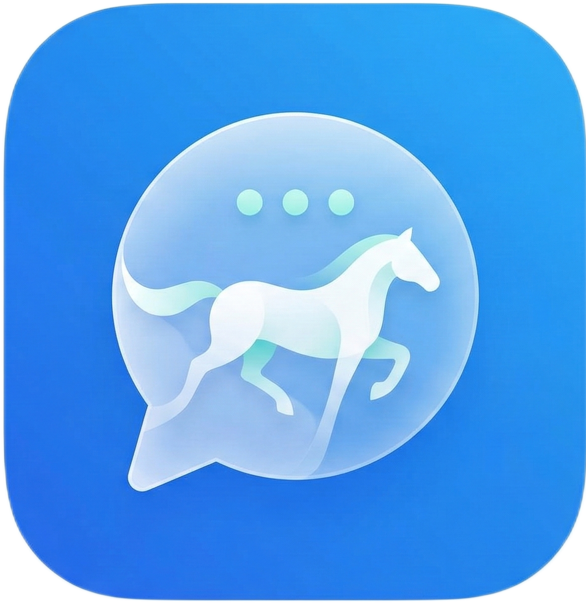

<p align="center">
  
</p>

<h1 align="center">PieChat</h1>

<p align="center">
  <strong>Nền tảng nhắn tin bảo mật, mã nguồn mở — xây dựng trên Matrix Protocol</strong>
</p>

<p align="center">
  <a href="https://piechart.site">🌐 Live Demo</a> ·
  <a href="docs.md">📖 Technical Docs</a> ·
  <a href="#quick-start">🚀 Quick Start</a>
</p>

---

## Giới thiệu

**PieChat** là nền tảng nhắn tin thời gian thực (real-time messaging), được thiết kế cho tổ chức và nhóm nhỏ từ 1.000 - 5.000 người dùng. Dự án sử dụng **Matrix Protocol** làm nền tảng giao tiếp, mang lại khả năng federation, bảo mật end-to-end (E2EE), và khả năng mở rộng.

### Tại sao chọn PieChat?

| Tiêu chí | PieChat | Giải pháp SaaS |
|----------|---------|----------------|
| **Quyền kiểm soát dữ liệu** | ✅ Self-hosted, toàn quyền | ❌ Lưu trên server bên thứ 3 |
| **Chi phí** | ✅ Miễn phí (chỉ trả hosting) | ❌ Trả phí theo user |
| **Tùy biến** | ✅ Mã nguồn mở, tuỳ chỉnh UI/UX | ❌ Giới hạn bởi vendor |
| **Tích hợp Bot/API** | ✅ Matrix API chuẩn, dễ tích hợp | ⚠️ Tuỳ vendor |
| **Federation** | ✅ Kết nối với Matrix network | ❌ Hệ thống đóng |

---

## Tính năng

### 💬 Nhắn tin
- **Chat 1-1** (Direct Message) với hệ thống kết bạn & danh bạ
- **Nhóm chat** (Group) với phân quyền admin/member
- **Kênh** (Channel) — tổ chức nhiều nhóm dưới 1 kênh
- **Tin nhắn chờ** — quản lý tin nhắn từ người lạ
- **Stickers & Emoji Reactions** — bộ sticker tuỳ chỉnh
- **Typing indicator** — hiển thị khi đối phương đang gõ
- **Đọc/chưa đọc** — badge unread count chính xác
- **Reply/Edit/Delete** — trả lời, sửa, xóa tin nhắn
- **Forward** — chuyển tiếp tin nhắn sang phòng khác
- **Pin conversations** — ghim hội thoại quan trọng
- **Tìm kiếm người dùng** theo số điện thoại

### 📞 Cuộc gọi (WebRTC)
- **Gọi thoại** (Voice Call) — giao diện xanh lá
- **Gọi video** (Video Call) — giao diện tím
- **Audio visualization** — hiển thị tín hiệu mic/loa realtime
- **Chọn thiết bị** — mic/loa selector
- **Âm thanh cuộc gọi** — ringtone, dialing, hangup sounds

### 🔐 Bảo mật & Xác thực
- **Đăng nhập bằng SĐT + Mật khẩu** với OTP 2FA
- **QR Code Login** — quét từ mobile để đăng nhập web
- **Trusted Device** — bỏ qua OTP cho thiết bị tin cậy
- **Rate limiting** — chống brute-force password & OTP
- **Login audit** — lịch sử đăng nhập, cảnh báo bất thường

### 🎨 Giao diện
- **Dark mode** mặc định, giao diện premium
- **Custom theme** — chọn màu accent hoặc nhập mã HEX tuỳ ý
- **Preset themes** — Xanh dương, Cam, Xanh lá, Tím, Hồng, Đỏ
- **Custom icons** — icon sidebar tuỳ chỉnh
- **Responsive** — desktop & mobile
- **Đa ngôn ngữ** — Tiếng Việt & English

### 🤖 Tích hợp Bot (AI Assistant)
- Hệ thống **Assistant** tích hợp sẵn
- Hỗ trợ cấu hình model AI (OpenAI, Groq, Ollama...)
- Giao diện quản lý bot trong Settings

### 📱 Đa nền tảng
- **PWA** — cài đặt như app native
- **Web** — truy cập qua trình duyệt
- **Android** (Capacitor) — đang phát triển
- **Desktop** (Tauri) — planned

### 🔔 Thông báo
- **Push notification** qua Service Worker
- **Click notification** → mở đúng phòng chat
- **Badge count** cho tin nhắn chưa đọc

---

## Kiến trúc hệ thống

```
┌─────────────┐     ┌──────────────────┐     ┌────────────────┐
│   Frontend   │────▶│   Nginx Proxy    │────▶│    Dendrite    │
│  (Next.js)   │     │   (SSL/Routing)  │     │ (Matrix Server)│
│  Port: 3000  │     │   Port: 80/443   │     │  Port: 8008    │
└─────────────┘     └──────────────────┘     └────────────────┘
                            │
                    ┌───────▼────────┐
                    │  Auth Service  │
                    │  (Express.js)  │
                    │  Port: 4000    │
                    └────────────────┘
```

### Stack công nghệ

| Layer | Công nghệ |
|-------|-----------|
| **Frontend** | Next.js 15, React 19, TypeScript, TailwindCSS |
| **State Management** | Zustand |
| **Real-time** | Matrix Client-Server API (polling) |
| **Voice/Video** | WebRTC (peer-to-peer) |
| **Backend** | Dendrite (Matrix Homeserver, Go) |
| **Auth** | Express.js, OTP via SMS webhook |
| **Proxy** | Nginx with Let's Encrypt SSL |
| **Deploy** | Docker Compose |
| **Hosting** | Oracle Cloud (Free Tier compatible) |

---

## Quick Start

### Yêu cầu
- Docker & Docker Compose
- Domain name (cho production)
- Node.js 22+ (cho development)

### 1. Clone & Setup

```bash
git clone https://github.com/Monkez/PieChat.git
cd PieChat
cp .env.example .env
# Sửa .env: DOMAIN, MATRIX_SERVER_NAME, SSL_EMAIL
```

### 2. Development (local)

```bash
# Terminal 1: Backend (Dendrite)
cd backend
go run ./cmd/dendrite-monolith-server

# Terminal 2: Auth Service
cd auth-service
npm install && npm run dev

# Terminal 3: Frontend
cd frontend
npm install && npm run dev
```

Truy cập: `http://localhost:3000`

### 3. Production (Docker)

```bash
docker compose up -d --build
```

Hệ thống sẽ tự động:
- Khởi tạo Dendrite (Matrix server)
- Chạy Auth Service (OTP + QR Login)
- Build & serve Frontend (Next.js)
- Cấu hình Nginx reverse proxy
- Cấp SSL certificate (Let's Encrypt)

### 4. Tạo user test

```bash
# Trong container Dendrite
docker exec -it piechat-dendrite \
  /usr/bin/create-account -config /etc/dendrite/dendrite.yaml \
  -username alice -password Pass@12345
```

---

## Cấu trúc thư mục

```
PieChat/
├── frontend/               # Next.js Frontend
│   ├── app/                # Pages (App Router)
│   │   ├── chat/           # Chat layout & rooms
│   │   ├── login/          # Đăng nhập
│   │   ├── register/       # Đăng ký
│   │   └── settings/       # Cài đặt
│   ├── components/         # UI Components
│   │   ├── chat/           # Chat-specific (call overlay, message list...)
│   │   └── ui/             # Design system (button, dialog, input...)
│   ├── hooks/              # Custom hooks (useWebRTC...)
│   ├── lib/
│   │   ├── services/       # API clients (matrix-service, sticker-service)
│   │   └── store/          # Zustand stores
│   └── public/             # Static assets
│       ├── call-sounds/    # Ringtone, dialing, hangup
│       ├── menubar-icons/  # Custom sidebar icons
│       └── stickers/       # Chat stickers
├── auth-service/           # Express.js Auth Microservice
│   └── src/
│       ├── routes/         # API routes (OTP, QR, devices)
│       └── services/       # Business logic (phone-otp, redis)
├── backend/                # Dendrite (forked Matrix homeserver)
├── deploy/                 # Prod deployment configs
│   ├── nginx/              # Nginx configuration
│   ├── setup-server.sh     # Server setup script
│   └── dendrite-production.yaml
├── assets/                 # Source assets (icons, images)
├── docker-compose.yml      # Production stack
└── .env.example            # Environment template
```

---

## Đóng góp

1. Fork repo
2. Tạo branch: `git checkout -b feature/ten-tinh-nang`
3. Commit: `git commit -m "feat: mô tả"`
4. Push: `git push origin feature/ten-tinh-nang`
5. Tạo Pull Request

---

## License

MIT License — Xem file [LICENSE](LICENSE) để biết chi tiết.

---

<p align="center">
  Made with ❤️ by <strong>Monkez</strong>
</p>
